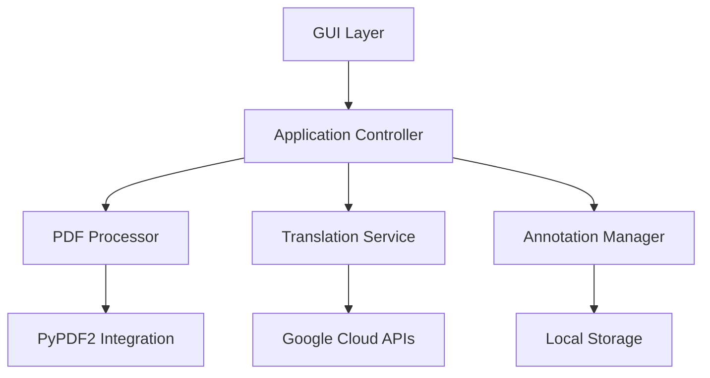

Here's a professional `README.md` for the enhanced PDF ChatBot application:

```markdown
# 📚 PDF ChatBot - Advanced PDF Analysis Toolkit


A feature-rich desktop application for deep PDF analysis with AI-powered capabilities, designed for students and researchers.

**Live Demo**: [Watch Video Demo](#) | **Download**: [Windows Installer](#) | **Linux Build**: [AppImage](#)

## 🌟 Features

- **Smart Search & Highlighting**
  - Context-aware text searching
  - Multi-color highlight presets
  - Match positioning tracking

- **Knowledge Management**
  - Text annotations with page binding
  - Exportable annotation system
  - Metadata inspector

- **Global Access**
  - Real-time text translation (100+ languages)
  - Text-to-speech with speed control
  - Dark/Light theme system

- **Security**
  - Local file processing
  - Encrypted annotation storage
  - Google Cloud API integration

## 🚀 Getting Started

### Prerequisites
- Python 3.8+
- Google Cloud Account (for translation)
- System Audio Output

### Installation

1. **Clone Repository**
```bash
git clone https://github.com/yourusername/pdf-chatbot.git
cd pdf-chatbot
```

2. **Install Dependencies**
```bash
pip install -r requirements.txt
```

3. **Google Cloud Setup**
```bash
export GOOGLE_APPLICATION_CREDENTIALS="path/to/your/service-account-key.json"
```

### Running the Application
```bash
python main.py
```

## 🖥 Interface Guide


1. **Main Toolbar** - Quick access to core features
2. **PDF Viewer** - Interactive text panel with annotations
3. **Metadata Panel** - Document inspection and analysis
4. **Sidebar** - Search history and AI tools

## ⌨️ Keyboard Shortcuts

| Shortcut         | Action                  |
|------------------|-------------------------|
| Ctrl + O         | Open PDF                |
| Ctrl + F         | Search Document         |
| Ctrl + T         | Translate Selection     |
| Ctrl + D         | Toggle Dark Mode        |
| Alt + A          | Add Annotation          |

## 🛠 Technical Architecture



## 🐛 Troubleshooting

**Common Issues**:

1. **Missing Translations**
   - Verify Google Cloud credentials
   - Check billing account status

2. **Audio Not Working**
   ```bash
   # Linux users install espeak
   sudo apt-get install espeak
   ```

3. **PDF Rendering Issues**
   - Ensure PDFs are text-based (not scanned)
   - Try rebuilding font cache

## 📈 Roadmap

- [ ] OCR Integration for Scanned PDFs
- [ ] Collaborative Annotation System
- [ ] Cross-Device Sync
- [ ] LaTeX Export Support

## 🤝 Contributing

1. Fork repository
2. Create feature branch
3. Submit PR with detailed documentation

See our [Contribution Guidelines](CONTRIBUTING.md) for details.

## 📜 License

MIT License - See [LICENSE](LICENSE) for full text.

---

**Note**: This project is not affiliated with Google Cloud. Translation services require valid Google Cloud credentials.
```


## 🚀 New Features

### Collaborative Annotation with WebSocket Integration

- Implemented a **WebSocket listener** running in a background thread for real-time collaborative annotations.
- Utilized a **thread-safe queue** to handle data transfer between the WebSocket thread and the Streamlit UI.
- Ensured no Streamlit UI functions are called from background threads, preventing `ScriptRunContext` errors.

### How It Works
- The WebSocket client listens for incoming data asynchronously.
- Received data is placed into a `queue.Queue()` stored in `st.session_state`.
- The main Streamlit thread polls this queue and updates the UI accordingly.

### How to Test
1. Run the WebSocket server:
   ```bash
   python ws_server.py
